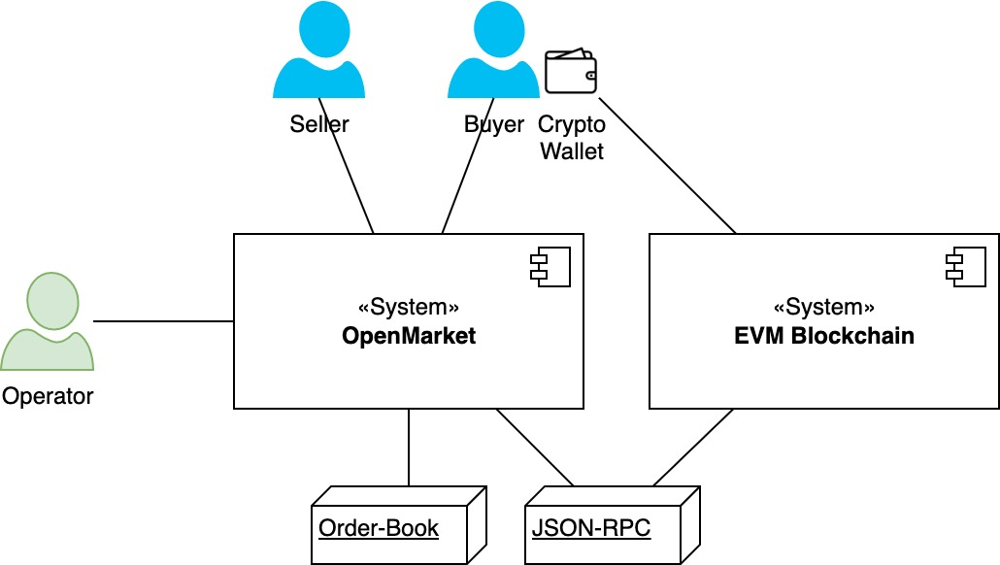
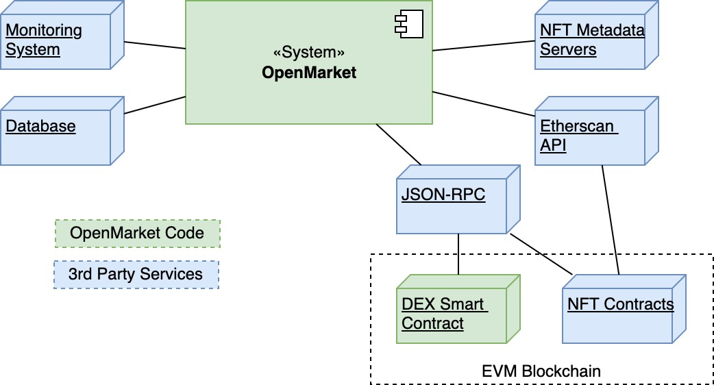
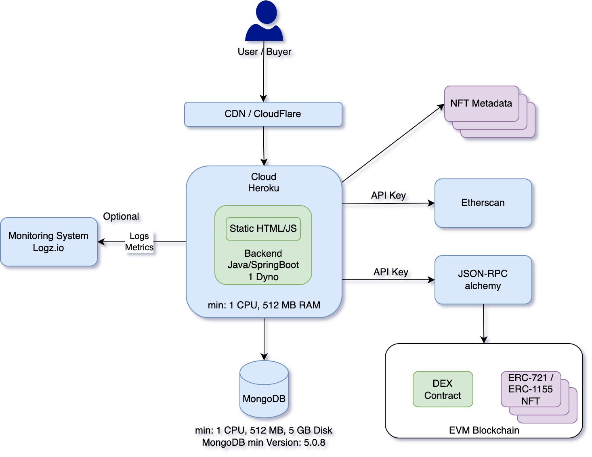

# Architecture

## Business Context

Buyer and Seller interact together over the OpenMarket platform. A Seller can list his NFTs with a fix price either with the native coin or an ERC-20 token to sell. A buyer can take this order and submit it with his crypto wallet into the blockchain to the DEX Smart Contract where the exchange will happen. 
The operator can monitor and configure OpenMarket. E.g., define which NFT token gets indexed, which payment options are available and so on. 

## Technical context

| System              | Explenation                                                                                                                                                              |
|---------------------|--------------------------------------------------------------------------------------------------------------------------------------------------------------------------|
| OpenMarket          | Backend and frontend. Self-developed. Backend is written in Java and Spring Boot framework.                                                                              |
| DEX Smart Contract  | Self-developed. Executes the swap between the Payment currency and the NFT.                                                                                              |
| Monitoring system   | Optional system to store the Log output. ELK stack recommended.                                                                                                          |
| Database            | MongoDB. Storing NFTs and its Metadata and as well the sell orders.                                                                                                      |
| JSON-RPC            | The API to the EVM blockchain. Registering to the DEX Smart Contract event. Reading blockchain data.                                                                     |
| Etherscan API       | Theoretically everything can be read out over the JSON-RPC. However, if there are many ERC-721 contracts to be indexed and observed the Etherscan API is more powerful.  |
| NFT Contracts       | The NFT contracts to index.                                                                                                                                              |
| NFT Metadata Server | Each ERC-721 contract has a tokenURI where the metadata are stored. This metadata (JSON-File only) gets stored into the DB during indexing the ERC-721 contract.         |

## Deployment and minimal system requirements

Recommended Deployment:
- CDN / Cloudflare: To filter out DDoS attacks.
- Heroku: Deployment of the OpenMarket Backend and Frontend.
- MongoDB: Version 5.0.8 or higher is required. Use https://www.mongodb.com/ as DB provider
- Monitoring System: Recommended Logz.io. Other logs collectors can be integrated
- Etherscan API key required. The Etherscan instance must support the selected EVM Blockchain.
- JSON-RPC access required
