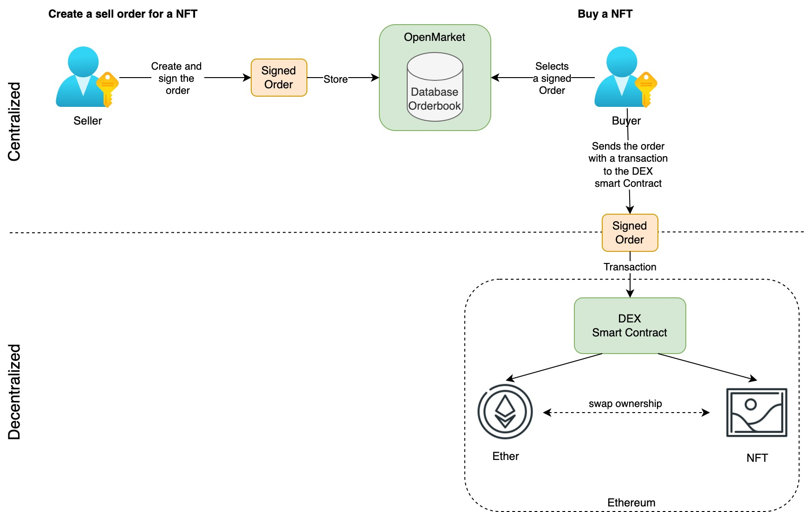

# How the DEX works

Technically there are two main components. 

- The order book - Contains all the signed orders (the NFTs which can be sold). The order book is off-chain.
- The DEX smart contract - Exchanges the assets in a single transaction.

## NFT Owner sells his NFT

The order book contains all the signed orders from the sellers (aka makers). Whenever someone wants to sell an NFT, the seller defines a fix price and the currency to pay with. After the seller creates a digital signature with his crypto wallet. This signed order will then be stored in the order book. 

The buyer (aka taker) will select the signed order and submit this order to the DEX smart contract. The DEX smart contracts will validate the order (signature, price match, and so on). If the order and signature is valid the DEX smart contract will exchange the assets in a decentralized way in a single transaction.